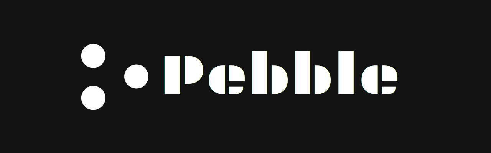

# 👋 Welcome to Pebble


**Note:** This documentation is a work in progress. New pages and updates would be continuously made as our ecosystem grows.


<figure><figcaption></figcaption></figure>

## Overview

**Pebble is a open protocol for end-to-end encrypted group-chat on blockchain.**

Take ownership of your messages, and stay ensured that only your intended parties can read what you send.

The entire protocol, its working, and products of its growing ecosystem, all would be published here for transparency, as and when they are released.

## Get Started

Whether you're a cryptography-enthusiast, a developer, or just an end-user, we have detailed explanation of everything to ensure you get onboarded smoothly.


[Broken link](broken-reference)


## Quick links




